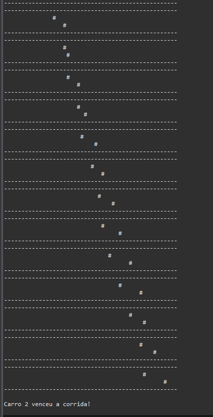

# CORRIDA

Estre trabalho consiste em criar uma simulção
de uma corrida entre dois carros, onde é possível
visualizar a progressão do

## 🚀 Tecnologias

- Java
- Biblioteca Lang do java

## ▶️ Uso

- Crie uma classe veiculo para instanciar os veiculos e seus metodos valores
- Crie uma classe corrida para definir os metodos da e regras de negocios da competição
- crie uma classe para ser a Main onde ela deverá simular a corrida consultando os metodos e objetos criados

## 📸 Preview

